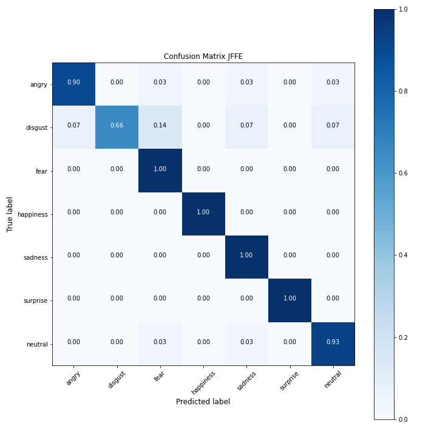
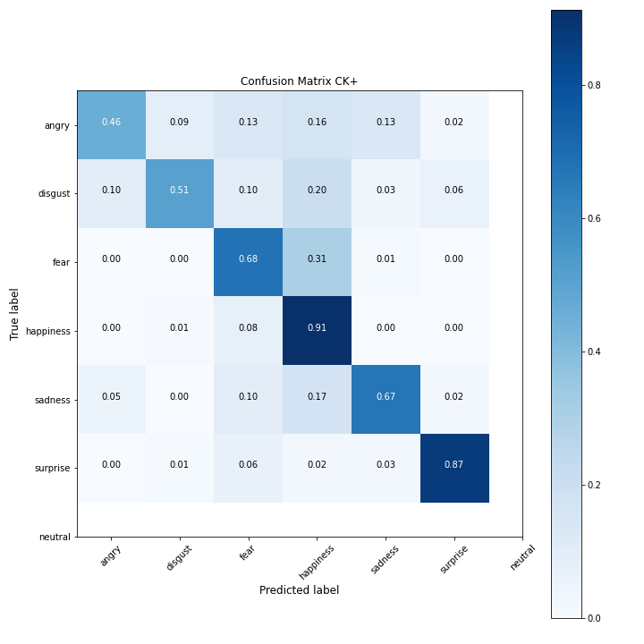
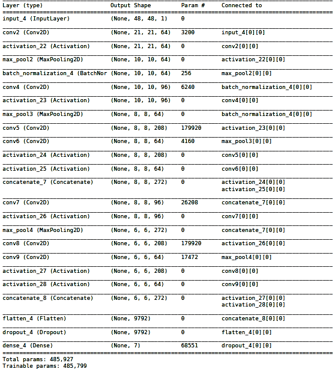

# Facial Emotion Recognition
### By Team Doggomaniacs, IIT Kanpur
This repository contains all the files for Emotion Recognition through Facial Expression recognition, a summer project under Brain and Cognitive Society, IIT Kanpur.  
The Documentation for the Project is here: [[Doc](https://docs.google.com/document/d/1_S7o_sjIJ0yEDf_mu1lZ3yBAOcsT6hbORnF6GvkNQRA/edit?fbclid=IwAR1UHVqlTVU_IazHMDv2Troj6LfdpXfdnNmquhT3e6sBZ9OBhMl6vcFfm2A)/[PDF](FER_Documentation.pdf)].

Goal of the project:
* Design a Model for Emotion Recognition in Images. Paper Implemented: [DeXpression: Deep Convolutional Neural Network for Expression Recognition
](https://arxiv.org/abs/1509.05371)
* Design a Model for Emotion Recognition in Videos. Paper Implemented: [Video-based emotion recognition using CNN-RNN and C3D hybrid networks](https://dl.acm.org/doi/pdf/10.1145/2993148.2997632)

## All Necessary files in the Project:
### For Emotion Recognition in Images 
| Topics | Links | Description |
| ------ | ----- | ----------- |
|Preprocessing In Images | [LINK]( Image/Emotion_Recognition(Pre_processing)FER2013.ipynb ) | Contains all the functions necessary for Preprocessing |
|Preprocessed Dataset | [LINK]( https://drive.google.com/file/d/1vMW1bcAoy9UzZ8V22_mKAghNDTtHfk-H/view?usp=sharing ) | Contains Preprocessed FER 2013 data. Stored in Drive |
|Model for Feature Extraction and Classification | [LINK]( Image/Model_for_static_image.ipynb ) | Contains  Model and Functions for Validation and Visualization |
|Result | [LINK]( Image/Confusion_matrix.png ) | Confusion Matrix of the Model |
### For Emotion Recognition in Videos
| Topics | Links | Description |
| ------ | ----- | -----------|
|Frame Extraction and Preprocessing for videos | [LINK]( Frame_Extraction ) | Folder with necessary python files for Frame Extraction |
|Extracted Frames dataset | [LINK]( Video/ds.zip ) | Frames extracted from BAUM-2 dataset |
|Model for Feature Extraction and Classification | [LINK]( Video/Video_emotion_Recognistion_with_data_functions.ipynb ) | Contains  Model and Functions for Validation and Visualization |

## Result of the Models:
### For Images:
|  | Dataset | Accuracy |
| ----- | ---- | ---- |
|Training | FER2013 | 95% |
|Testing | JFFE | 97% |
|Testing | CK+ | 59% |



### For Videos:
|  | Dataset | Model | Accuracy |
| ----- | ---- | ---- | ---- |
|Training | BAUM-2 | CNN+LSTM | 36% |
|Training | BAUM-2 | C3D | 28.4% |

## Description Of Various Files/Folder in the Repository
### [Emotion_Recognition(Pre_processing)FER2013.ipynb](Image/Emotion_Recognition(Pre_processing)FER2013.ipynb)
This file contains functions for preprocessing. Preprocessing for Emotion Recognition includes: Face detection, Rotation, Cropping, Smoothing, Rotation.

**These are the functions in the file:**
* **modification(image):** Takes array as an input. The array datatype initially is str, which is converted to int type. The image is, then, resized to 480x480p from 48x48p for face detection purpose. This function return the final resized image.  
This function is specifically for dataset downloaded from [here](https://www.kaggle.com/deadskull7/fer2013).    
```
modified_image = modification(image)
```
* **rotate(image)**: Takes image as input and returns a rotated image. The rotation is based on the alignment of eyes in the image.  
```
rotated_image = rotation(input_image)
```
* **crop(image,x_factor=2.1,y_factor=3.2)**: Takes image, two other parameters(x_factor,y_factor) as input and returns a cropped image. The cropping is based on the distance between eyes of the face. x_factor,y_factor defines width and height of cropped image as a factor of distance between eyes. The deafult values are tuned parameters.  
```
cropped_image= crop(rotated_image)
```
* **preProcessing(images,x_factor=2.1,y_factor=3.2)**: Takes array/list of images as input. It applies the above function on each image and then smoothing. Then resizes the image. The function returns an array of images.  
This function is specifically for dataset downloaded from [here](https://www.kaggle.com/deadskull7/fer2013).  
```
x = preProcessing(data['pixels'])
```
* **savePreprocessed(data,x_factor=2.1,y_factor=3.2):** Takes Pandas DataFrame with pixels and emotion as input and saves the preprocessed images into a .csv file. This is the FER2013  preprocessed data saved using this function: [FER_preprocessed.zip](https://drive.google.com/file/d/1vMW1bcAoy9UzZ8V22_mKAghNDTtHfk-H/view?usp=sharing).  
This function is specifically for dataset downloaded from [here](https://www.kaggle.com/deadskull7/fer2013).  
```
savePreprocessed(data)
```
* **get_faces(image,x_factor=2.1,y_factor=3.2):** Takes an image as an input. The function detects all the faces in the image, apply preprocessing on all of them and then returns a list with all preprocessed faces along with a list of labels of location of faces in the image(for labelling prupose).  
```
faces,labels = get_faces(image)
```

### [Model2.ipynb](Image/Model2.ipynb)
This file contains model for feature extraction and classification for Image dataset. It also contain function for Visualisation and Validation.

**These are the functions in the file:**
* **classifierModel(input_shape):** Returns a model for feature extarction and classification. The model uses tensorflow backend.  
Overview of Model:



```
model = classifierModel((48,48,1))
```
* **plot_confusion_matrix(cm,classes,normalize=False,title='Confusion Matrix',cmap=plt.cm.Blues):** This function prints a visual representation of *confusion matrix* with classes which are passed to it as input.
```
plot_confusion_matrix(confusion_matrix,classes=class_names,normalize=True)
```

### [Frame_Extraction](Frame_Extraction)
This folder contains python files for Frame Extraction from BAUM-2 dataset.
##### Important Note
> After downloading all the zip files of BAUM dataset. Extract them all and then copy all the Subject folders into a single directory.

**These are the files in the folder:**
* **extract_frames.py [-h] [-s source_path] [-d destination_path] [-n number_of_frames]** :
This function extracts frames from each video of all subject and store them in a separate folder for further use. This is the Frame Extracted dataset generated from BAUM-2 dataset using this file: [ds.zip](ds.zip)  
*source_path*: The path of directory where all subjects folder are stored.  
*destination_path*: The path of directory where you want to store all extracted frames.  
*number_of_frames*: The number of frames you want to extract from each video.  

How to call:  
```
python3 extract_frames.py -s "/home/legolas/BAUM_dataset" -d "/home/legolas/Extracted" -n 16
```  
For help:  
```
python3 extract_frames.py -h
```

* **create_list.py [-h] [-s source_path] [-d destination_path]** :
This function creates a text file of all the frames extracted with their emotion. This is the list generated usnig this file: [main.csv](main.csv).  
*source_path*: The path of directory where all extracted frames are stored.  
*destination_path*: The path of text file you are going to create.  

How to call:  
```
python3 create_list.py -s "/home/legolas/Extracted" -d "main.txt"
``` 
For help:  
```
python3 create_list.py -h
```

### [Video_emotion_Recognistion_with_data_functions.ipynb](Video/Video_emotion_Recognistion_with_data_functions.ipynb)
This file contains model for feature extraction and classification for Video dataset. It also contain function for Visualisation and Validation.

**These are the functions in the file:**
* **fine_tune(input_shape):** Returns a LSTM model . The model uses tensorflow backend.
```
It uses the pre-trained image recognistion model for genrating image embeddings. Which are used as an input for LSTM and then outputs the predicted emotion
```
```
fine_tuned_model = fine_tune((12,48,48,1))
No. of frames extracted from one video = 12
Image shape = (48,48,1)
```
* **classifier_Model(X_input):** Returns the image embedding and takes input multiple frames of images. The model uses tensorflow backend.
```
It uses Time_Distributed layers so that each frame of images is processed simentaneously and then fed to the LSTM network. 
```
* **LSTM_model(input_shape):** It takes the shape of input which is (12,48,48,1). It returns the corresponding output as the predicted emotion.

* **plot_confusion_matrix(cm,classes,normalize=False,title='Confusion Matrix',cmap=plt.cm.Blues):** This function prints a visual representation of *confusion matrix* with classes which are passed to it as input.  
```
plot_confusion_matrix(confusion_matrix,classes=class_names,normalize=True)
```

### [Real_time_video.py](real_time_video.py)
This file opens the webcam and classifies facial expressions in real time.
